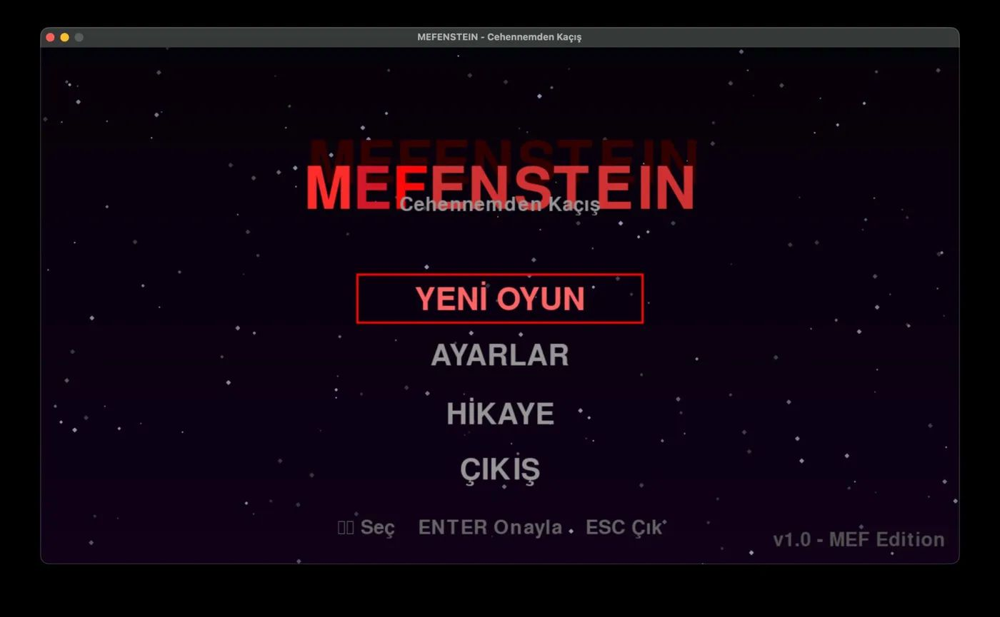
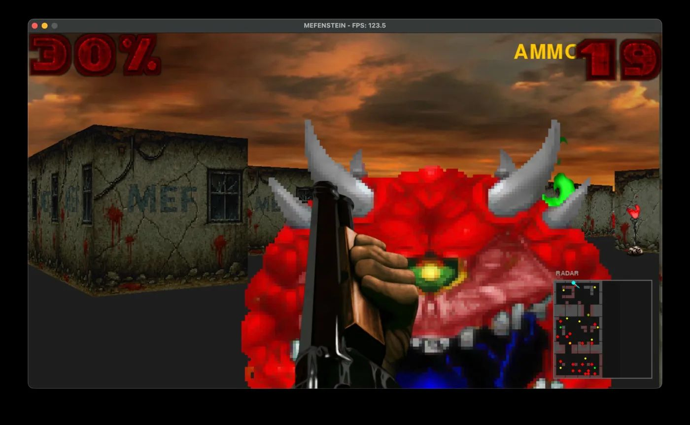
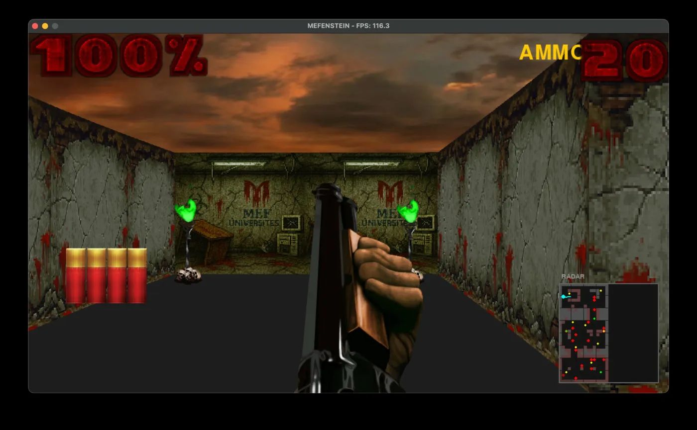

# MEFENSTEIN 🎮

> **Cehennemden Kaçış** — A Wolfenstein-style First Person Shooter built from scratch in Python using raycasting. No game engine, no OpenGL. Pure math.


---

## Screenshots

<p align="center">
  
  
</p>
<p align="center">
  
</p>

---

## Features

- **Raycasting renderer** — 3D perspective without a game engine, same algorithm as Wolfenstein 3D (1992)
- **Multiple enemy types** — Soldier, CacoDemon, CyberDemon with individual health, speed, and attack stats
- **Enemy AI** — BFS pathfinding, line-of-sight raycasting, attack/pain/death animation states
- **Weapon system** — Shotgun and Rifle with different damage, range, spread, and fire rate
- **Pickup system** — Ammo and health packs on the map, enemies drop ammo on death
- **HUD** — Health display, ammo counter, radar minimap
- **Fullscreen support** — F11 to toggle, scales to any resolution
- **Pause menu** — ESC to pause, Q to return to main menu

---

## Installation

```bash
git clone https://github.com/atagokmir/MEFENSTEIN.git
cd MEFENSTEIN
pip install -r requirements.txt
python main.py
```

---

## Controls

| Key | Action |
|-----|--------|
| W A S D | Move |
| Mouse | Look around |
| Left Click | Shoot |
| 1 / 2 | Switch weapon (Shotgun / Rifle) |
| ESC | Pause / Unpause |
| Q _(while paused)_ | Return to main menu |
| F11 | Toggle fullscreen |

---

## Project Structure

```
MEFENSTEIN/
├── main.py              # Game loop and window management
├── settings.py          # Constants and configuration
├── requirements.txt
├── src/
│   ├── map.py           # Map data and world grid
│   ├── player.py        # Player movement, health, ammo
│   ├── raycasting.py    # Core 3D raycasting renderer
│   ├── object_renderer.py  # HUD, background, minimap, textures
│   ├── sprite_object.py    # Sprite and animated sprite base classes
│   ├── object_handler.py   # Spawning and managing all game objects
│   ├── npc.py           # Enemy types and AI logic
│   ├── pathfinding.py   # BFS pathfinding for enemy movement
│   ├── weapon.py        # Weapon system and animations
│   ├── pickup.py        # Ammo and health pickup logic
│   ├── sound.py         # Sound effects and music
│   └── menu.py          # Main menu and pause menu
└── resources/           # Textures, sprites, sounds
```

---

## How It Works

The renderer is based on the classic **raycasting** technique from the early 1990s. For each vertical column of pixels on screen, a ray is cast from the player's position. When the ray hits a wall, the wall height is calculated based on distance — closer walls appear taller, creating the illusion of depth.

Enemy visibility uses the same technique: NPCs check if a ray from the player reaches them before hitting a wall. If visible, they switch from idle to attack or chase mode using **BFS pathfinding** on the tile grid.

---

## License

MIT License — see [LICENSE](LICENSE) for details.

---

<p align="center">Made at MEF University 🎓</p>